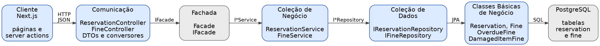

# LibraryHub

Sistema de gestão de empréstimos de biblioteca, desenvolvido para a disciplina de Programação
Orientada a Objetos (Ciência da Computação — UFAPE). A entrega da terceira VA foi feita na branch
`terceira-va` e também está na `main`.

O sistema controla os membros da biblioteca, os itens do acervo (livros e revistas), os empréstimos
que ligam um membro a um item, a fila de reservas de um item emprestado e as multas por atraso ou
dano.

## Terceira VA

A terceira VA tratou de duas situações que a entrega anterior não cobria: a **disputa por um item que
já está emprestado**, que favorecia quem aparecia primeiro por acaso, e a **falta de consequência para
a má devolução**, já que um item atrasado ou danificado era aceito como uma devolução em dia. O
relatório completo está em [`RELATORIO_3VA.md`](RELATORIO_3VA.md), com versões em
[PDF](RELATORIO_3VA.pdf) e [DOCX](RELATORIO_3VA.docx).

Funcionalidades implementadas, correspondentes às regras 8 a 13 abaixo:

1. **Reserva de item** — o membro entra na fila de um item emprestado; a reserva pode ser cancelada e
   é atendida quando aquele membro pega o item.
2. **Fila respeitada no empréstimo** — quando o item volta, o primeiro da fila tem prioridade.
3. **Multa por atraso** — gerada na devolução fora do prazo, a 1,50 por dia.
4. **Multa por dano** — registrada pela equipe, com valor pela gravidade.
5. **Bloqueio por débito** — membro com multa em aberto não faz empréstimo nem é removido.
6. **Pagamento e saldo devedor** — a tela de multas mostra o total em aberto e dá baixa.



O diagrama de classes está em [`diagrama-3va.png`](diagrama-3va.png). `Fine` é abstrata e
tem duas subclasses, `OverdueFine` e `DamagedItemFine`, cada uma com seu cálculo de `getAmount()`;
`Reservation` é uma entidade própria com estado em `ReservationStatus` (`ACTIVE`, `FULFILLED`,
`CANCELLED`).

### Onde cada regra é verificada

| Regra | Camada | Exceção |
| --- | --- | --- |
| Reserva atendida ou cancelada não muda mais de estado | Classe básica | `ReservationNotActiveException` |
| Multa paga não é paga de novo | Classe básica | `FineAlreadyPaidException` |
| Membro não tem duas reservas ativas do mesmo item | Coleção de negócio | `DuplicatedReservationException` |
| Empréstimo tem no máximo uma multa por dano | Coleção de negócio | `DuplicatedFineException` |
| Item disponível é emprestado, não reservado | Fachada | `ItemAvailableException` |
| Item reservado por outro membro não é emprestado | Fachada | `ItemReservedByAnotherMemberException` |
| Membro com multa em aberto não pega item nem é removido | Fachada | `MemberWithUnpaidFinesException` |

### Testes da terceira VA

| Nível | Arquivo | Casos |
| --- | --- | --- |
| Unitário | `ReservationTest`, `FineTest` | 6 + 6 |
| Unitário com Mockito | `ReservationServiceTest` | 3 |
| Integração | `ReservationFineIntegrationTest` | 8 |
| API | `ReservationControllerApiTest` | 6 |
| Interface | `frontend/tests/reservations.spec.js` | 2 |

### Validação final

| Verificação | Resultado |
| --- | --- |
| `mvn test` | 55 testes, 55 aprovados |
| `npm run lint` | sem erros |
| `npm run build` | compila, sem aviso de lockfile |
| `npx playwright test` | 4 aprovados, 0 falhos |

Para conferir a partir de um clone:

```bash
git clone https://github.com/Lucas210301/libraryhub.git
cd libraryhub && git checkout terceira-va   # a main tem o mesmo conteúdo
```

### Limitações conhecidas

- O total em aberto das multas é somado em memória, porque o valor de cada multa é calculado.
- A multa por atraso só é gerada na devolução; um item vencido e nunca devolvido não gera cobrança.
- A fila de reserva não tem prazo de validade.
- A multa por dano pode ser registrada para um empréstimo ainda ativo.
- A suíte de interface não apaga o que cria.
- O repositório não tem integração contínua.

## Stack

| Camada | Tecnologia |
| --- | --- |
| Back end | Java 21, Spring Boot 3.5, Spring Data JPA, Bean Validation |
| Banco | PostgreSQL (execução) e H2 em memória (testes) |
| Front end | Next.js (App Router), React, axios, Tailwind CSS, daisyUI |
| Testes | JUnit 5, Mockito, MockMvc, Playwright |

## Arquitetura em camadas

```
Comunicação (controller, dto, conversor)
        |
     Fachada  ..................... ponto único de acesso ao sistema
        |
Coleção de Negócio (service) ...... regras de negócio
        |
Coleção de Dados (repository) ..... JPA
        |
Classes Básicas de Negócio (model)
```

Cada camada acessa a camada de baixo apenas através de interfaces: `IFacade`, `IMemberService`,
`IItemService`, `ILoanService`, `IReservationService`, `IFineService`, `IMemberRepository`,
`IItemRepository`, `ILoanRepository`, `IReservationRepository` e `IFineRepository`.

## Regras de negócio

1. Um livro fica quinze dias com o membro; uma revista, sete dias. A data prevista de devolução é
   calculada pelo próprio item, de forma polimórfica.
2. Um item que já está emprestado não pode ser emprestado de novo.
3. Um empréstimo que já foi devolvido não pode ser devolvido de novo.
4. Um e-mail só pode pertencer a um membro.
5. Um membro pode ter no máximo três empréstimos ativos ao mesmo tempo.
6. Um membro com empréstimos ativos não pode ser removido.
7. Um item que está emprestado não pode ser removido do acervo.
8. Só é possível reservar um item que está emprestado; item disponível deve ser emprestado direto.
9. Um membro não pode ter duas reservas ativas para o mesmo item.
10. Quando o item volta ao acervo, o primeiro da fila de reserva tem prioridade sobre os demais.
11. A devolução fora do prazo gera multa automática de 1,50 por dia de atraso.
12. Um empréstimo aceita no máximo uma multa por dano, com valor definido pela gravidade.
13. Um membro com multa em aberto não faz novo empréstimo e não pode ser removido.

## Endpoints

| Método | Rota | Descrição |
| --- | --- | --- |
| GET | `/members` | Lista os membros |
| GET | `/members/{id}` | Busca um membro |
| POST | `/members` | Cadastra um membro |
| PUT | `/members/{id}` | Atualiza um membro |
| DELETE | `/members/{id}` | Remove um membro |
| GET | `/items` | Lista todos os itens |
| GET | `/items/available` | Lista apenas os itens disponíveis |
| GET | `/items/{id}` | Busca um item |
| POST | `/items/books` | Cadastra um livro |
| POST | `/items/magazines` | Cadastra uma revista |
| DELETE | `/items/{id}` | Remove um item |
| GET | `/loans` | Lista os empréstimos |
| GET | `/loans/{id}` | Busca um empréstimo |
| POST | `/loans` | Registra um empréstimo |
| PUT | `/loans/{id}/return` | Registra a devolução |
| GET | `/reservations` | Lista as reservas |
| GET | `/reservations/{id}` | Busca uma reserva |
| POST | `/reservations` | Cria uma reserva |
| PUT | `/reservations/{id}/cancel` | Cancela uma reserva |
| GET | `/fines` | Lista as multas |
| GET | `/fines/summary` | Total de multas em aberto |
| GET | `/fines/{id}` | Busca uma multa |
| POST | `/fines/damages` | Registra multa por dano |
| PUT | `/fines/{id}/pay` | Registra o pagamento de uma multa |

Status codes utilizados: 200, 201, 204, 400 (validação), 404 (não encontrado) e 409 (conflito com
uma regra de negócio).

O back end é uma API REST e não serve páginas: acessar `http://localhost:8080` na raiz devolve a
página de erro padrão do Spring. A interface fica em `http://localhost:3000`.

Nas telas de empréstimo e de reserva, o campo de membro mostra o nome seguido do e-mail, para que
dois membros homônimos possam ser distinguidos na hora de escolher.

## Como executar

Pré-requisitos: JDK 21, Maven, Node.js 20 ou superior e PostgreSQL.

### 1. Banco

O back end espera o banco `libraryhub` em `localhost:5432`, com usuário e senha `postgres`.

```bash
PGPASSWORD=postgres psql -h 127.0.0.1 -U postgres -c 'CREATE DATABASE libraryhub;'
```

Confira as credenciais em `backend/src/main/resources/application.properties`. As tabelas são
criadas automaticamente pelo Hibernate (`ddl-auto=update`).

### 2. Back end

```bash
cd backend
mvn spring-boot:run
```

Aguarde a mensagem `Started LibraryhubApplication` e confirme com:

```bash
curl -i http://localhost:8080/members
```

### 3. Front end

Em outro terminal:

```bash
cd frontend
cp .env.local.example .env.local
npm install
npm run dev
```

O front end sobe em `http://localhost:3000` e o back end em `http://localhost:8080`.

## Como testar

### Back end

```bash
cd backend
mvn test
```

Esperado: `Tests run: 55, Failures: 0, Errors: 0`.

### Front end

```bash
cd frontend
npm run lint
npm run build
```

### Testes end-to-end

Os testes E2E usam a API real, então o **back end precisa estar rodando**. Na primeira vez, baixe os
navegadores do Playwright:

```bash
cd frontend
npx playwright install chromium
```

Depois:

```bash
npx playwright test
```

Esperado: `4 passed`.

O Playwright sobe e derruba o próprio servidor de desenvolvimento. Por isso **não deixe um
`npm run dev` rodando** ao executar os testes: duas instâncias do Next.js compartilhando a mesma
pasta `.next` se corrompem, e a porta 3000 fica presa. Se isso acontecer:

```bash
pgrep -f next-server | xargs -r kill
rm -rf frontend/.next
```

Para ver o navegador durante a execução, ou gerar o relatório em HTML:

```bash
npx playwright test --headed
npx playwright test --reporter=html && npx playwright show-report
```

Os dados de teste saem de `frontend/tests/library.js`, que sorteia títulos e autores reais do
acervo e acrescenta um código de exemplar, como uma biblioteca faz para distinguir duas cópias do
mesmo livro. Por isso uma execução cria registros do tipo `Macunaíma (exemplar GFP6)` em vez de
identificadores artificiais, e a interface continua legível durante o desenvolvimento.

Ainda assim, cada execução acrescenta registros e nada é apagado no fim. Para zerar o banco local de
desenvolvimento:

```bash
PGPASSWORD=postgres psql -h 127.0.0.1 -U postgres -c 'DROP DATABASE libraryhub;'
PGPASSWORD=postgres psql -h 127.0.0.1 -U postgres -c 'CREATE DATABASE libraryhub;'
```

## Documentação

- [`RELATORIO_3VA.md`](RELATORIO_3VA.md), [`RELATORIO_3VA.pdf`](RELATORIO_3VA.pdf) e
  [`RELATORIO_3VA.docx`](RELATORIO_3VA.docx) — relatório de desenvolvimento da terceira VA.
- [`GUIA_3VA.md`](GUIA_3VA.md) — roteiro da terceira VA: branch, testes e entrega.
- [`arquitetura-3va.png`](arquitetura-3va.png) — camadas do sistema com os componentes da terceira VA.
- [`diagrama-3va.png`](diagrama-3va.png) — diagrama de classes da terceira VA.
- `docs/ARQUITETURA.md` — diagrama de classes, camadas, exceções e mapa dos requisitos da disciplina.
- `docs/api.http` — requisições prontas para o Insomnia, o Postman ou a extensão REST Client.
- `docs/diagrama-3va.dot` e `docs/diagrama-3va.svg` — fonte Graphviz e versão vetorial do mesmo
  diagrama de classes.
