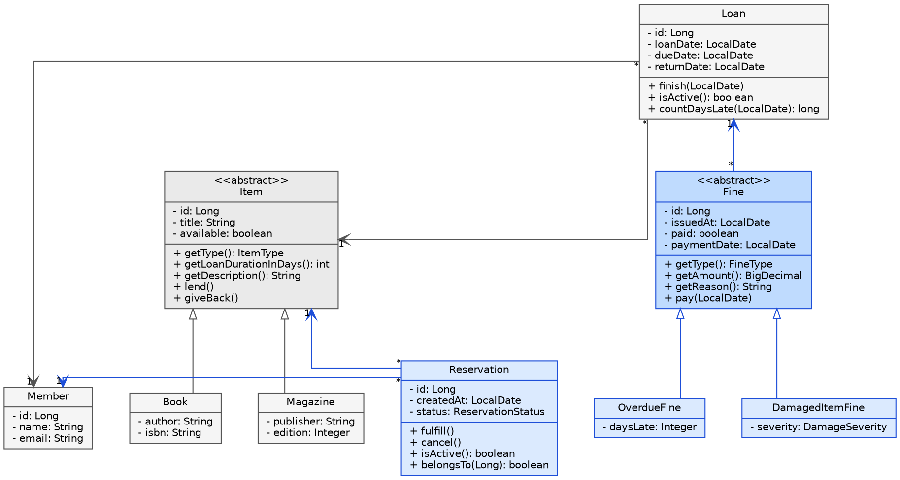

# Relatório de Desenvolvimento — Terceira VA

**Disciplina:** Programação Orientada a Objetos  
**Curso:** Ciência da Computação — UFAPE  
**Professor:** Igor Medeiros Vanderlei  
**Estudante:** Lucas Tchaikovsky dos Santos Rodrigues — GitHub `Lucas210301`  
**Projeto:** LibraryHub — gestão de empréstimos de biblioteca  
**Repositório:** https://github.com/Lucas210301/libraryhub  
**Branch da terceira VA:** `terceira-va`  
**Período coberto:** 04/09/2026 a 13/09/2026  

Este relatório trata exclusivamente do desenvolvimento da última semana. A base entregue na segunda
VA — membros, itens e empréstimos — é citada apenas quando necessário para explicar as decisões novas.

## 1. Apresentação do Problema

O LibraryHub controla o acervo de uma biblioteca e os empréstimos feitos aos seus membros. Na entrega
anterior o sistema já registrava membros, itens (livros e revistas) e empréstimos, com prazo de
devolução calculado pelo tipo do item e limite de três empréstimos ativos por membro.

Duas situações reais da biblioteca ainda não tinham tratamento, e foram o objeto desta VA.

A primeira é a **disputa por um item que já está emprestado**. Quem procurasse um livro em uso não
tinha como registrar interesse: dependia de voltar à biblioteca e torcer para que o item estivesse na
estante. Isso favorecia quem aparecia primeiro por acaso, não quem esperava há mais tempo.

A segunda é a **falta de consequência para a má devolução**. O sistema aceitava a devolução de um item
semanas atrasado, ou danificado, exatamente como aceitaria uma devolução em dia, e o membro podia
pegar outro item na sequência sem restrição.

Funcionalidades implementadas para resolver as duas:

1. **Reserva de item** — o membro entra na fila de um item emprestado; a reserva pode ser cancelada e
   é atendida automaticamente quando aquele membro pega o item.
2. **Fila respeitada no empréstimo** — quando o item volta, o primeiro da fila tem prioridade e um
   terceiro membro é impedido de levá-lo enquanto a reserva estiver ativa.
3. **Multa por atraso** — gerada automaticamente na devolução fora do prazo, proporcional aos dias.
4. **Multa por dano** — registrada pela equipe, com valor definido pela gravidade.
5. **Bloqueio por débito** — membro com multa em aberto não faz novo empréstimo nem é removido.
6. **Pagamento e saldo devedor** — a tela de multas mostra o total em aberto e permite dar baixa.

## 2. Modelo de Classes

{width=80%}

**Figura 1** — Diagrama de classes. Em azul, as classes criadas nesta VA; em cinza, as da entrega
anterior, mostradas apenas pelos relacionamentos.

### 2.1 Principais decisões de modelagem

**`Reservation` como classe própria, e não como atributo de `Item`.** Guardar em `Item` um campo
`reservedBy` quebraria assim que a biblioteca quisesse mais de uma pessoa na fila, e perderia a data
de entrada, que é justamente o critério de ordenação. Como entidade com estado próprio, a reserva
permite fila, histórico e cancelamento sem mexer em `Item`.

**Estado da reserva em enum, e não em booleanos.** `ReservationStatus` tem `ACTIVE`, `FULFILLED` e
`CANCELLED`. Dois booleanos permitiriam o estado impossível de uma reserva atendida e cancelada ao
mesmo tempo; o enum torna esse estado inexpressável.

**`Fine` abstrata com duas subclasses.** As duas multas compartilham identidade, data de emissão,
situação de pagamento e a ligação com o empréstimo, mas calculam o valor de formas incompatíveis: uma
multiplica dias de atraso por uma diária, a outra consulta uma tabela de gravidade. Em vez de uma
classe única com um `if` sobre um campo `tipo` e metade dos atributos sempre nulos, a hierarquia deixa
cada regra na classe a que pertence, e quem chama `getAmount()` não precisa saber qual multa recebeu.

**Valor da multa é calculado, não armazenado.** `getAmount()` deriva o valor dos atributos da
subclasse; guardá-lo em coluna abriria a possibilidade de o valor gravado divergir da regra que o
gerou. A contrapartida está na seção 4.

**`Fine` aponta para `Loan`, não para `Member` e `Item`.** Toda multa nasce de um empréstimo, que já
carrega quem pegou e o que foi pego; repetir as associações criaria dois caminhos para a mesma
informação. Por fim, as invariantes ficam nas próprias classes básicas: `Reservation.fulfill()`,
`cancel()` e `Fine.pay()` verificam a situação atual antes de mudá-la e nenhuma expõe setter para o
estado, o mesmo padrão que `Item.lend()` já seguia.

### 2.2 Conceitos de orientação a objetos

| Conceito | Onde aparece |
| --- | --- |
| Abstração | `Fine` define o que toda multa é e sabe fazer, sem dizer como o valor é calculado |
| Herança | `OverdueFine` e `DamagedItemFine` estendem `Fine` |
| Polimorfismo | `getAmount()`, `getType()` e `getReason()` têm implementação própria em cada subclasse; `FineService.totalUnpaid()` e `FineConverter` operam sobre `Fine` sem nenhum `instanceof` |
| Encapsulamento | `status`, `paid` e `paymentDate` são privados e só mudam por métodos que validam antes |
| Associação | `Reservation` associa `Member` e `Item`; `Fine` associa `Loan` |
| Coesão de método | `Reservation.requireActive()` e `Facade.fulfillReservationQueue()` isolam uma decisão cada |
| Coesão de classe | `ReservationService` trata de reservas; `FineService`, de multas |
| Coesão de hierarquia | As subclasses de `Fine` variam apenas em valor e motivo |

## 3. Arquitetura da Solução

O módulo foi encaixado nas camadas existentes, sem estrutura paralela, e nenhuma tecnologia nova foi
introduzida: Java 21 com Spring Boot 3.5, Spring Data JPA sobre PostgreSQL, Bean Validation, front end
em Next.js com axios e daisyUI, e testes com JUnit 5, Mockito, MockMvc, H2 e Playwright.

{width=100%}

**Figura 2** — Camadas do sistema. Em azul, os componentes criados nesta VA. Cada camada só conhece a
de baixo por interface.

| Camada | Artefatos criados |
| --- | --- |
| Classes básicas (`business.model`) | `Reservation`, `ReservationStatus`, `Fine`, `OverdueFine`, `DamagedItemFine`, `FineType`, `DamageSeverity` |
| Coleção de dados (`data`) | `IReservationRepository`, `IFineRepository` |
| Coleção de negócio (`business.service`) | `IReservationService`, `ReservationService`, `IFineService`, `FineService` |
| Fachada (`business.facade`) | Sete operações novas em `IFacade` e `Facade` |
| Comunicação (`communication`) | `ReservationController`, `FineController`, quatro DTOs, dois conversores |
| Exceções (`exception`) | Nove classes novas, herdando de `BusinessException` |
| Interface gráfica (`frontend`) | Telas de reservas e multas, dois server actions, dois formulários |

Um pedido de reserva percorre: navegador → server action (Next.js) → `POST /reservations` em JSON →
`ReservationController` → `IFacade.reserveItem` → cadastros de membros, itens e reservas → JPA →
PostgreSQL. A resposta faz o caminho inverso, com o `ReservationConverter` transformando a entidade em
`ReservationDTOResponse`. `Reservation` ganhou tabela própria com chaves estrangeiras para membro e
item; `Fine` usa herança de tabela única, com a coluna discriminadora `fine_type` separando `OVERDUE`
de `DAMAGE` — a mesma estratégia já usada em `Item`.

| Método | Rota | Descrição | Status |
| --- | --- | --- | --- |
| GET | `/reservations` | Lista as reservas | 200 |
| GET | `/reservations/{id}` | Busca uma reserva | 200, 404 |
| POST | `/reservations` | Cria uma reserva | 201, 400, 404, 409 |
| PUT | `/reservations/{id}/cancel` | Cancela uma reserva | 200, 404, 409 |
| GET | `/fines` | Lista as multas | 200 |
| GET | `/fines/summary` | Total em aberto | 200 |
| GET | `/fines/{id}` | Busca uma multa | 200, 404 |
| POST | `/fines/damages` | Registra multa por dano | 201, 400, 404, 409 |
| PUT | `/fines/{id}/pay` | Registra o pagamento | 200, 404, 409 |

| Regra de negócio | Camada | Exceção |
| --- | --- | --- |
| Reserva atendida ou cancelada não muda mais de estado | Classe básica | `ReservationNotActiveException` |
| Multa paga não é paga de novo | Classe básica | `FineAlreadyPaidException` |
| Membro não tem duas reservas ativas do mesmo item | Coleção de negócio | `DuplicatedReservationException` |
| Empréstimo tem no máximo uma multa por dano | Coleção de negócio | `DuplicatedFineException` |
| Item disponível é emprestado, não reservado | Fachada | `ItemAvailableException` |
| Item reservado por outro membro não é emprestado | Fachada | `ItemReservedByAnotherMemberException` |
| Membro com multa em aberto não pega item nem é removido | Fachada | `MemberWithUnpaidFinesException` |

As três últimas ficaram na fachada porque nenhuma pode ser respondida por um cadastro sozinho: cruzam,
respectivamente, itens e reservas; membros, itens e reservas; e membros, empréstimos e multas.

## 4. Dificuldades Encontradas

### 4.1 Modelagem e implementação

**Onde colocar a regra da fila.** A primeira versão verificava a reserva dentro de `LoanService`, o
que obrigava o cadastro de empréstimos a conhecer o repositório de reservas. A regra foi movida para o
método privado `Facade.fulfillReservationQueue`, e cada cadastro voltou a tratar de um assunto só.

**Exceção checada em um caminho improvável.** `fulfillReservationQueue` só trabalha com reservas já
filtradas como ativas, mas `fulfill()` declara `ReservationNotActiveException`. Em vez de capturar e
ignorar, propaguei até o `LoanController`, que devolve 409: se o estado mudar entre a consulta e a
alteração, o sistema recusa a operação em vez de gravar algo inconsistente.

**Ordem de remoção e chaves estrangeiras.** Remover um membro passou a violar integridade referencial.
A limpeza foi ordenada na fachada — reservas, multas, empréstimos e por último o membro — dentro de um
método com `@Transactional(rollbackFor = Exception.class)`. O `rollbackFor` foi necessário porque as
exceções do projeto são checadas, e o Spring não desfaz a transação para elas por padrão.

**Consulta por subclasse com herança de tabela única.** Verificar se um empréstimo já tem multa por
dano não podia usar método derivado, porque o discriminador não é atributo mapeado. Resolvi com JPQL
explícita sobre `DamagedItemFine`, mantendo a checagem no repositório em vez de espalhar `instanceof`.

**Testar multa por atraso.** Como `dueDate` vem de `LocalDate.now()`, não é possível criar pela fachada
um empréstimo já vencido. Em vez de abrir um setter só para o teste, `Loan.countDaysLate` e
`OverdueFine.getAmount` são testados no nível unitário com datas fixas, e o teste de integração usa a
multa por dano, que não depende de data, para exercitar o bloqueio do devedor.

### 4.2 Ambiente e integração

A maior parte do tempo perdido não foi em código de negócio, e sim em fazer o ambiente rodar junto
pela primeira vez. A porta 5432 estava ocupada por um PostgreSQL nativo, então o container Docker
nunca publicava a porta, com o sintoma enganoso de o container aparecer como ativo; a solução foi usar
a instalação nativa, parar o container e criar ali o banco `libraryhub`, que também não existia. Um
processo `next dev` travado segurava a porta 3000 havia mais de seis horas, e os navegadores do
Playwright nunca tinham sido baixados — os dois faziam a suíte travar sem mensagem clara.

### 4.3 Confiabilidade dos testes de interface

**Seletor ambíguo.** `getByRole("alert")` capturava, além do banner de erro do formulário, um elemento
que o próprio Next.js insere em toda página. A correção foi extrair o banner para o componente
`ErrorAlert`, reutilizado por todos os formulários, e marcá-lo com um `data-testid` que o teste passou
a usar como alvo.

**Dados de teste ilegíveis.** As fixtures geravam registros como `Playwright Book 1789093254506`; ao
falhar, o relatório não dizia nada sobre o cenário. Foram reescritas a partir de dados reais de acervo.

**Membros homônimos.** O campo de seleção mostrava apenas o nome, tornando duas pessoas homônimas
indistinguíveis para o usuário e para o teste. O formulário passou a exibir o e-mail ao lado do nome.

**Instabilidade e configuração.** Com dois workers a suíte alternava entre passar e falhar, porque os
testes compartilham o banco; passou a rodar em série com orçamento maior. Além disso, o Next.js
reclamava de lockfile duplicado, resolvido fixando a raiz do workspace, e as pastas de artefato do
Playwright escapavam do `.gitignore`, que estava ancorado apenas na raiz.

| Verificação | Resultado |
| --- | --- |
| `mvn test` | 55 testes, 55 aprovados, BUILD SUCCESS |
| `npm run lint` | sem erros |
| `npm run build` | compila, sem o aviso de lockfile |
| `npx playwright test` | 4 aprovados, 0 falhos, 44,6 s |

A estabilização consumiu 9 commits, 13 arquivos e um saldo de +229/−87 linhas. Nenhuma alteração foi
necessária no back end Java, o que indica que o problema estava na configuração e no acoplamento dos
testes de interface, não nas regras de negócio.

## 5. Matriz de Responsabilidades

O projeto é individual, conforme o item 1 das orientações da terceira VA. Todas as contribuições estão
no repositório `Lucas210301/libraryhub`, branch `terceira-va`.

### 5.1 Requisitos mínimos individuais

| Membro | Funcionalidade | Requisito atendido | Artefato desenvolvido | Evidência no Git |
| --- | --- | --- | --- | --- |
| Lucas | Reserva | Classe básica de negócio (1/2) | `business/model/Reservation.java`, `ReservationStatus.java` | `1e44b23` |
| Lucas | Multa | Classe básica de negócio (2/2) | `business/model/Fine.java`, `OverdueFine.java`, `DamagedItemFine.java`, `FineType.java`, `DamageSeverity.java` | `1e44b23` |
| Lucas | Reserva | Coleção de dados (1/2) | `data/IReservationRepository.java` | `1e44b23` |
| Lucas | Multa | Coleção de dados (2/2) | `data/IFineRepository.java` | `1e44b23` |
| Lucas | Reserva | Coleção de negócio (1/2) | `business/service/IReservationService.java`, `ReservationService.java` | `1e44b23` |
| Lucas | Multa | Coleção de negócio (2/2) | `business/service/IFineService.java`, `FineService.java` | `1e44b23` |
| Lucas | Reserva e multa | Exceção em classe básica | `ReservationNotActiveException` em `Reservation.fulfill/cancel`; `FineAlreadyPaidException` em `Fine.pay` | `1e44b23` |
| Lucas | Reserva e multa | Exceção em coleção de negócio | `DuplicatedReservationException` em `ReservationService.create`; `DuplicatedFineException` em `FineService.registerDamage` | `1e44b23` |
| Lucas | Fila e débito | Exceção em fachada | `ItemAvailableException`, `ItemReservedByAnotherMemberException`, `MemberWithUnpaidFinesException` | `1e44b23` |
| Lucas | Reserva e multa | Teste unitário (15 casos) | `business/model/ReservationTest.java`, `FineTest.java`, `business/service/ReservationServiceTest.java` | `1e44b23` |
| Lucas | Fila e débito | Teste de integração (8 casos) | `integration/ReservationFineIntegrationTest.java` | `1e44b23` |
| Lucas | Reserva | Teste de API (6 casos) | `api/ReservationControllerApiTest.java` | `1e44b23` |
| Lucas | Reserva | Teste de interface | `frontend/tests/reservations.spec.js` | `1e44b23`, `daa0cb3`, `9aab374`, `e1edd98` |
| Lucas | Reserva e multa | Interface gráfica dos casos de uso | `frontend/src/app/reservations`, `frontend/src/app/fines`, `ReservationForm.js`, `DamageFineForm.js` | `1e44b23`, `7ee3e00`, `93e6adf` |

### 5.2 Requisitos gerais do projeto

| Requisito geral | Como está atendido nesta semana | Arquivo |
| --- | --- | --- |
| Herança | `OverdueFine` e `DamagedItemFine` estendem `Fine`, que é abstrata | `business/model/Fine.java` |
| Polimorfismo | `getAmount()`, `getType()` e `getReason()` resolvidos em tempo de execução; `totalUnpaid()` soma sem conhecer a subclasse | `business/service/FineService.java` |
| Encapsulamento | `status`, `paid` e `paymentDate` sem setter, alterados só por métodos que validam | `business/model/Reservation.java`, `Fine.java` |
| Associação | `Reservation` para `Member` e `Item`; `Fine` para `Loan` | `business/model/Reservation.java`, `Fine.java` |
| Interface entre camadas | `IReservationService`, `IFineService`, `IReservationRepository`, `IFineRepository`, novas assinaturas em `IFacade` | `business/service`, `data`, `business/facade` |
| Coesão | `requireActive` e `fulfillReservationQueue` isolam uma decisão cada | `Reservation.java`, `Facade.java` |
| Organização em pacotes | Cada artefato no pacote da sua camada | seção 3 |
| Documentação | `README.md` e `docs/ARQUITETURA.md` revisados com rotas, regras, exceções e fixtures | `2cb8ea5`, `6c2b69d` |
| Uso do git | 11 commits com o usuário `Lucas210301` | seção 5.3 |

### 5.3 Histórico de commits

| Data | Hash | Mensagem | Escopo |
| --- | --- | --- | --- |
| 10/09 | `b9485db` | Envia projeto inicial do LibraryHub | Estrutura do repositório |
| 10/09 | `1e44b23` | Complete LibraryHub project setup | Back end, testes e telas, incluindo o módulo desta VA |
| 11/09 | `6c2b69d` | Revise README for clarity and updated instructions | Documentação |
| 11/09 | `b72d3ee` | build(frontend): set the Next.js workspace root | Aviso de lockfile |
| 11/09 | `2c62c0c` | chore(gitignore): ignore the Playwright artifact folders | Higiene do repositório |
| 11/09 | `7ee3e00` | refactor(forms): reuse the ErrorAlert component | Reúso do banner de erro |
| 11/09 | `daa0cb3` | test(e2e): target the form error banner by test id | Seletor ambíguo |
| 11/09 | `9aab374` | test(e2e): run the suite serially with a longer budget | Estabilidade da suíte |
| 11/09 | `93e6adf` | feat(forms): show the email next to the member name | Homônimos |
| 11/09 | `e1edd98` | test(e2e): build fixtures from real library data | Fixtures legíveis |
| 11/09 | `2cb8ea5` | docs(readme): cover the fixtures and the member dropdown | Documentação |

As classes desta VA entraram em `1e44b23`; os nove commits de 11/09 correspondem à estabilização
descrita na seção 4. A matriz da seção 5.1 indica o caminho de arquivo de cada requisito, permitindo a
verificação por arquivo além do hash.

## 6. Conclusões

As seis funcionalidades da seção 1 foram implementadas e estão cobertas por testes automatizados nos
quatro níveis exigidos. O sistema passou a tratar a disputa por um item como fila com critério
explícito, e a devolução deixou de ser evento neutro: atraso e dano geram cobrança, e o débito
restringe o membro até ser quitado. Os mínimos individuais foram atendidos a partir de duas classes que
não existiam no projeto: quatro classes básicas novas, duas coleções de dados, duas coleções de
negócio, nove exceções nos três níveis, cinco classes de teste no back end e um arquivo de teste de
interface.

A validação final fechou com 55 de 55 testes de back end aprovados, lint e build do front end sem erros
e a suíte de interface passando em 44,6 segundos — situação diferente da do início da semana, quando a
suíte travava sem produzir resultado. Para a demonstração, o banco foi carregado com um acervo
realista: 8 membros, 12 livros, 4 revistas, 4 empréstimos e 3 reservas.

O objetivo era fechar as duas lacunas de comportamento sem reestruturar o que já funcionava, e isso foi
cumprido: as alterações em código pré-existente se resumiram ao acréscimo de `countDaysLate` em `Loan`,
às novas verificações em `Facade.registerLoan` e `Facade.removeMember`, e aos `catch` correspondentes
em dois controllers. Nenhuma classe da entrega anterior precisou ser reescrita, e a estabilização dos
testes de interface não exigiu nenhuma alteração no back end — dois indícios de que a separação em
camadas está cumprindo o papel de absorver mudança.

**Aprendizados.** O mais concreto foi o critério para decidir entre cadastro e fachada: se a resposta a
uma pergunta exige mais de uma coleção, a regra não pertence a nenhum cadastro isoladamente — a
primeira versão da fila violava isso, e o sintoma apareceu como acoplamento antes de qualquer erro de
execução. O segundo foi sobre polimorfismo em domínio real: a hierarquia de `Fine` não foi criada para
"usar herança", surgiu porque duas regras de cálculo disputavam o mesmo método, e o resultado é que um
terceiro tipo de multa não exige tocar em nenhum `if` existente. O terceiro veio dos testes de
interface: um teste que depende de seletor genérico ou de dados aleatórios não falha por causa do
sistema, falha por causa do próprio teste, e ainda por cima de forma ilegível.

**Limitações.** O total em aberto é somado em memória, porque o valor da multa é derivado. A multa por
atraso só é gerada no momento da devolução, então um item vencido e nunca devolvido não gera cobrança.
A fila de reserva não tem prazo de validade. A multa por dano pode ser registrada para um empréstimo
ainda ativo. A suíte de interface não remove o que cria, deixando 6 membros e 2 exemplares a mais por
execução. E o repositório ainda não tem integração contínua.

**Continuidade.** Prazo de retirada para a reserva, passando a vez ao próximo da fila; rotina diária
gerando multa para empréstimos vencidos; limpeza das fixtures ao fim da suíte e um workflow de CI
rodando as quatro verificações a cada push; e relatório em PDF com o saldo devedor por membro, que
atenderia um dos pontos extras das diretrizes.

## Anexo — Roteiro de verificação

```bash
git clone https://github.com/Lucas210301/libraryhub.git
cd libraryhub && git checkout terceira-va
cd backend && mvn test                 # 55 testes
cd ../frontend && npm install && npx playwright install chromium
npx playwright test                    # 4 testes
```
