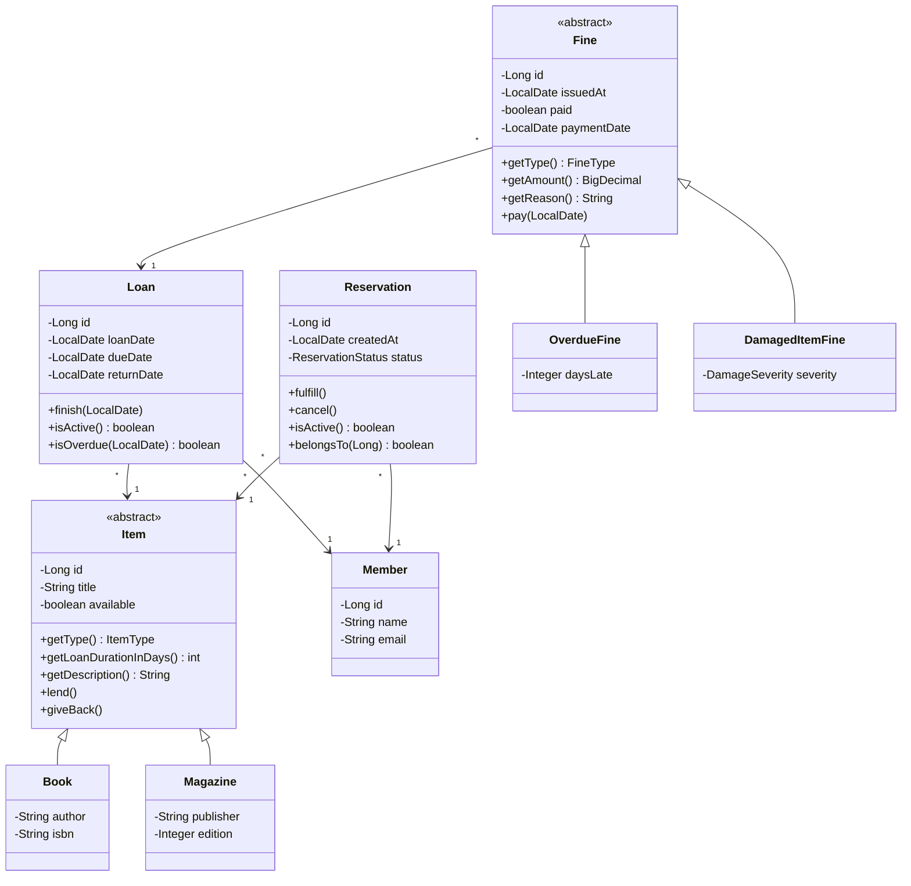

# Arquitetura do LibraryHub

## 1. Diagrama de classes

O mesmo diagrama está em `diagrama-3va.png`, com as classes acrescentadas na terceira VA
destacadas.

`Item` é mapeado com herança de tabela única (`SINGLE_TABLE`), com a coluna discriminadora
`item_type` separando `BOOK` de `MAGAZINE`.

## 2. Camadas e pacotes

| Camada | Pacote | Responsabilidade |
| --- | --- | --- |
| Classes básicas de negócio | `business.model` | Estado e comportamento do domínio |
| Coleção de dados | `data` | Persistência, via Spring Data JPA |
| Coleção de negócio | `business.service` | Regras de cada cadastro |
| Fachada | `business.facade` | Ponto único de acesso e regras que envolvem mais de um cadastro |
| Comunicação | `communication` | Controllers REST, DTOs e conversores |

Regra de dependência: comunicação → fachada → serviços → repositórios → modelo. A camada de
comunicação nunca chama um serviço ou um repositório diretamente.

## 3. Conceitos de POO no código

| Conceito | Onde aparece |
| --- | --- |
| Abstração | `Item` é abstrata e define o contrato de um item emprestável |
| Herança | `Book` e `Magazine` estendem `Item`; `OverdueFine` e `DamagedItemFine` estendem `Fine` |
| Polimorfismo | `getLoanDurationInDays()`, `getType()` e `getDescription()` têm implementação própria em cada subclasse de `Item`; `getAmount()`, `getType()` e `getReason()` fazem o mesmo em `Fine`; `Loan`, `ItemConverter`, `FineConverter` e `FineService.totalUnpaid()` operam sobre o tipo abstrato |
| Encapsulamento | Todos os atributos são privados; `available` só muda por `lend()` e `giveBack()`, `status` só muda por `fulfill()` e `cancel()`, e `paid` só muda por `pay()` |
| Associação | `Loan` associa `Member` e `Item`; `Reservation` associa `Member` e `Item`; `Fine` associa `Loan` (todas `@ManyToOne`) |
| Interface entre camadas | `IFacade`, `IMemberService`, `IItemService`, `ILoanService`, `IReservationService`, `IFineService` e os cinco repositórios |
| Coesão de método | Cada método resolve uma única responsabilidade, como `Loan.finish` |
| Coesão de classe | `MemberService` trata apenas de membros; `LoanService`, apenas de empréstimos |
| Coesão de hierarquia | A hierarquia de `Item` varia apenas na política de empréstimo e na descrição |

## 4. Exceções

Todas herdam de `BusinessException`, são imutáveis (sem atributos mutáveis e sem setters) e são
checadas, então a assinatura de cada método declara o que pode acontecer.

| Exceção | Levantada em | Camada | Status HTTP |
| --- | --- | --- | --- |
| `ItemNotAvailableException` | `Item.lend()` | Classe básica de negócio | 409 |
| `LoanAlreadyReturnedException` | `Loan.finish()` | Classe básica de negócio | 409 |
| `MemberAlreadyRegisteredException` | `MemberService.create()` e `update()` | Coleção de negócio | 409 |
| `ItemOnLoanException` | `ItemService.delete()` | Coleção de negócio | 409 |
| `MemberNotFoundException` | `MemberService.findById()` | Coleção de negócio | 404 |
| `ItemNotFoundException` | `ItemService.findById()` | Coleção de negócio | 404 |
| `LoanNotFoundException` | `LoanService.findById()` | Coleção de negócio | 404 |
| `LoanLimitExceededException` | `Facade.registerLoan()` | Fachada | 409 |
| `MemberWithActiveLoansException` | `Facade.removeMember()` | Fachada | 409 |
| `ReservationNotActiveException` | `Reservation.fulfill()` e `cancel()` | Classe básica de negócio | 409 |
| `FineAlreadyPaidException` | `Fine.pay()` | Classe básica de negócio | 409 |
| `DuplicatedReservationException` | `ReservationService.create()` | Coleção de negócio | 409 |
| `DuplicatedFineException` | `FineService.registerDamage()` | Coleção de negócio | 409 |
| `ReservationNotFoundException` | `ReservationService.findById()` | Coleção de negócio | 404 |
| `FineNotFoundException` | `FineService.findById()` | Coleção de negócio | 404 |
| `ItemAvailableException` | `Facade.reserveItem()` | Fachada | 409 |
| `ItemReservedByAnotherMemberException` | `Facade.registerLoan()` | Fachada | 409 |
| `MemberWithUnpaidFinesException` | `Facade.registerLoan()` e `removeMember()` | Fachada | 409 |

Ciclo completo de uma exceção: a regra identifica a situação e levanta a exceção, a fachada a
propaga, e o controller a captura e transforma em uma resposta HTTP com corpo JSON
(`ErrorDTOResponse`).

## 5. Operações da fachada que envolvem mais de um cadastro

- `registerLoan` consulta o cadastro de membros, o cadastro de itens e o cadastro de empréstimos
  antes de aplicar o limite de três empréstimos ativos.
- `returnLoan` encerra o empréstimo e devolve o item ao acervo.
- `removeMember` só remove o membro se o cadastro de empréstimos confirmar que não há empréstimo
  ativo, e antes apaga o histórico de empréstimos daquele membro.
- `removeItem` apaga reservas, multas e histórico do item e delega a remoção ao cadastro de itens,
  que recusa itens emprestados.
- `reserveItem` consulta os cadastros de membros e de itens e só aceita a reserva de um item que
  está emprestado.
- `registerLoan` também consulta o cadastro de multas e o de reservas: recusa quem tem débito em
  aberto e respeita a ordem da fila, atendendo a reserva do próprio membro quando existe.

Esses métodos são anotados com `@Transactional(rollbackFor = Exception.class)`: se uma regra falhar
no meio da operação, nada é gravado.

## 6. Testes

| Arquivo | Tipo | O que cobre |
| --- | --- | --- |
| `business/model/ItemTest.java` | Unitário | Polimorfismo do prazo, disponibilidade e `ItemNotAvailableException` |
| `business/model/LoanTest.java` | Unitário | Cálculo da data prevista, devolução e `LoanAlreadyReturnedException` |
| `business/service/MemberServiceTest.java` | Unitário com Mockito | Regra de e-mail único, isolada do banco |
| `integration/FacadeIntegrationTest.java` | Integração | Fachada, serviços, repositórios e banco H2 no mesmo fluxo |
| `api/MemberControllerApiTest.java` | API | Rotas, JSON e status codes com MockMvc |
| `frontend/tests/members.spec.js` | Interface | Cadastro de membro pelo navegador, com Playwright |
| `business/model/ReservationTest.java` | Unitário | Ciclo de vida da reserva e `ReservationNotActiveException` |
| `business/model/FineTest.java` | Unitário | Cálculo polimórfico do valor e `FineAlreadyPaidException` |
| `business/service/ReservationServiceTest.java` | Unitário com Mockito | Regra de reserva duplicada, isolada do banco |
| `integration/ReservationFineIntegrationTest.java` | Integração | Fila de reserva e bloqueio por multa em aberto |
| `api/ReservationControllerApiTest.java` | API | Rotas de reserva, JSON e status codes |
| `frontend/tests/reservations.spec.js` | Interface | Fluxo de reserva pelo navegador |

## 7. Mapa dos requisitos da disciplina

| Requisito | Onde está |
| --- | --- |
| Arquitetura cliente-servidor | `backend` (Spring Boot) e `frontend` (Next.js) |
| Comunicação em JSON | DTOs em `communication.dto` e `@RestController` |
| Camadas model, repository, service, fachada, comunicação | Pacotes descritos na seção 2 |
| Herança | `Book` e `Magazine` |
| Polimorfismo | Seção 3 |
| Encapsulamento | Seção 3 |
| Associação entre classes | `Loan` com `Member` e `Item` |
| Interface entre camadas | Seção 2 |
| Coesão nos três níveis | Seção 3 |
| Organização em pacotes | Seção 2 |
| Duas classes básicas de negócio | `Member`, `Item`, `Book`, `Magazine` e `Loan` |
| Duas coleções de dados | `IMemberRepository`, `IItemRepository` e `ILoanRepository` |
| Duas coleções de negócio | `MemberService`, `ItemService` e `LoanService` |
| Teste unitário, de integração, de API e de interface | Seção 6 |
| Exceção em classe básica, em coleção de negócio e em fachada | Seção 4 |
| Interface gráfica dos casos de uso | Páginas em `frontend/src/app` |
